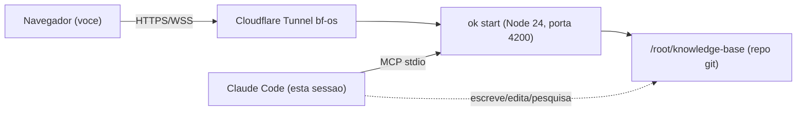

# O que é o Open Knowledge (OK)

> [!TIP]
> Este documento foi escrito 100% via **MCP nativo** — o Claude Code conversando direto com o servidor OK rodando na VPS, sem passar pelo navegador.

## Resumo

Open Knowledge é um editor de markdown "AI-native" para manter bases de conhecimento (wikis, specs, notas) — pensado para ser editado tanto por humanos (WYSIWYG) quanto por agentes de IA via MCP. O conteúdo vive como arquivos `.md`/`.mdx` num repositório git; a colaboração em tempo real usa CRDT (Hocuspocus/Yjs) por baixo dos panos.

> [!IMPORTANT]
> A trava de segurança padrão do OK só aceita conexões `localhost`/`127.0.0.1` (Host + Origin). Pra expor publicamente em `openknowledge.bflabs.com.br` foi necessário **patchar o bundle do servidor** (3 funções: `isAllowedWorkspaceHostHeader`, `isAllowedApiOrigin`, `isLoopbackHostname`/`hasValidLocalOpOrigin`) — decisão consciente, sem camada de autenticação adicional (pendente).

## Arquitetura



## Como cada peça foi resolvida

<Tabs>
  <Tab label="Instalação">

Node 24 isolado em `/opt/node24` (a VPS tinha Node 20; o pacote exige `>=24`). CLI instalada globalmente ali, sem mexer no Node do sistema.

  </Tab>
  <Tab label="Persistência">

Serviço systemd `openknowledge.service`, `Restart=always`, rodando `ok start --react-shell-dist-dir ...` — serve editor + API na mesma porta (4200).

  </Tab>
  <Tab label="Exposição">

Rota adicionada no túnel Cloudflare `bf-os` (`openknowledge.bflabs.com.br` → `127.0.0.1:4200`) + DNS CNAME (corrigido depois de apontar pro túnel errado por engano).

  </Tab>
  <Tab label="Integração com IA">

O botão nativo "abrir no Claude Code" da UI web **não funciona em servidor headless** — ele depende de `xdg-mime` (registro de URL scheme de desktop), que não existe numa VPS sem GUI. A integração real que funciona é o **MCP nativo** (`ok mcp`), registrado direto em `~/.claude.json` apontando pro binário, com roteamento por `cwd`.

  </Tab>
</Tabs>

## Onde isso te ajuda

```html preview h=169px w=1024px
<div style="font-family:system-ui,sans-serif;padding:20px">
  <div id="cards" style="display:flex;gap:14px;flex-wrap:wrap"></div>
  <script>
    var stats = [
      ['Componentes markdown-nativos', '5', 'Callout, Accordion, Mermaid, Math, wiki-embed', 'var(--chart-1)'],
      ['Embeds html preview', '4 starters', 'chart, stat-cards, svg, controle interativo', 'var(--chart-2)'],
      ['Camadas patchadas', '3 funcoes', 'host header, origin, local-op origin', 'var(--chart-5)']
    ];
    document.getElementById('cards').innerHTML = stats.map(function (s) {
      return '<div style="flex:1;min-width:170px;padding:16px;background:var(--card);' +
        'color:var(--card-foreground);border:1px solid var(--border);' +
        'border-radius:var(--radius)">' +
        '<div style="font-size:13px;color:var(--muted-foreground)">' + s[0] + '</div>' +
        '<div style="font-size:26px;font-weight:700;margin-top:4px">' + s[1] + '</div>' +
        '<div style="font-size:12px;margin-top:4px;color:' + s[3] + '">' + s[2] + '</div>' +
        '</div>';
    }).join('');
  </script>
</div>
```

> [!WARNING]
> Ainda sem autenticação na API pública — qualquer um com a URL tem leitura/escrita no `/root/knowledge-base`. Combinado com você deixar assim por ora; Cloudflare Access é o próximo passo natural quando quiser fechar isso.

## Ver também

![[bem-vindo]]
---
title: O que é o Open Knowledge
---
# O que é o Open Knowledge (OK)

# O que é o Open Knowledge (OK)

> [!TIP]
> Este documento foi escrito 100% via **MCP nativo** — o Claude Code conversando direto com o servidor OK rodando na VPS, sem passar pelo navegador.

## Resumo

Open Knowledge é um editor de markdown "AI-native" para manter bases de conhecimento (wikis, specs, notas) — pensado para ser editado tanto por humanos (WYSIWYG) quanto por agentes de IA via MCP. O conteúdo vive como arquivos `.md`/`.mdx` num repositório git; a colaboração em tempo real usa CRDT (Hocuspocus/Yjs) por baixo dos panos.

> [!IMPORTANT]
> A trava de segurança padrão do OK só aceita conexões `localhost`/`127.0.0.1` (Host + Origin). Pra expor publicamente em `openknowledge.bflabs.com.br` foi necessário **patchar o bundle do servidor** (3 funções: `isAllowedWorkspaceHostHeader`, `isAllowedApiOrigin`, `isLoopbackHostname`/`hasValidLocalOpOrigin`) — decisão consciente, sem camada de autenticação adicional (pendente).

## Arquitetura


## Como cada peça foi resolvida

<Tabs>
  <Tab label="Instalação">

Node 24 isolado em `/opt/node24` (a VPS tinha Node 20; o pacote exige `>=24`). CLI instalada globalmente ali, sem mexer no Node do sistema.

  </Tab>
  <Tab label="Persistência">

Serviço systemd `openknowledge.service`, `Restart=always`, rodando `ok start --react-shell-dist-dir ...` — serve editor + API na mesma porta (4200).

  </Tab>
  <Tab label="Exposição">

Rota adicionada no túnel Cloudflare `bf-os` (`openknowledge.bflabs.com.br` → `127.0.0.1:4200`) + DNS CNAME (corrigido depois de apontar pro túnel errado por engano).

  </Tab>
  <Tab label="Integração com IA">

O botão nativo "abrir no Claude Code" da UI web **não funciona em servidor headless** — ele depende de `xdg-mime` (registro de URL scheme de desktop), que não existe numa VPS sem GUI. A integração real que funciona é o **MCP nativo** (`ok mcp`), registrado direto em `~/.claude.json` apontando pro binário, com roteamento por `cwd`.

  </Tab>
</Tabs>

## Onde isso te ajuda

```html preview h=169px w=1024px
<div style="font-family:system-ui,sans-serif;padding:20px">
  <div id="cards" style="display:flex;gap:14px;flex-wrap:wrap"></div>
  <script>
    var stats = [
      ['Componentes markdown-nativos', '5', 'Callout, Accordion, Mermaid, Math, wiki-embed', 'var(--chart-1)'],
      ['Embeds html preview', '4 starters', 'chart, stat-cards, svg, controle interativo', 'var(--chart-2)'],
      ['Camadas patchadas', '3 funcoes', 'host header, origin, local-op origin', 'var(--chart-5)']
    ];
    document.getElementById('cards').innerHTML = stats.map(function (s) {
      return '<div style="flex:1;min-width:170px;padding:16px;background:var(--card);' +
        'color:var(--card-foreground);border:1px solid var(--border);' +
        'border-radius:var(--radius)">' +
        '<div style="font-size:13px;color:var(--muted-foreground)">' + s[0] + '</div>' +
        '<div style="font-size:26px;font-weight:700;margin-top:4px">' + s[1] + '</div>' +
        '<div style="font-size:12px;margin-top:4px;color:' + s[3] + '">' + s[2] + '</div>' +
        '</div>';
    }).join('');
  </script>
</div>
```

> [!WARNING]
> Ainda sem autenticação na API pública — qualquer um com a URL tem leitura/escrita no `/root/knowledge-base`. Combinado com você deixar assim por ora; Cloudflare Access é o próximo passo natural quando quiser fechar isso.

## Ver também

![[bem-vindo]]
> [!TIP]
> Este documento foi escrito 100% via **MCP nativo** — o Claude Code conversando direto com o servidor OK rodando na VPS, sem passar pelo navegador.

## Resumo

Open Knowledge é um editor de markdown "AI-native" para manter bases de conhecimento (wikis, specs, notas) — pensado para ser editado tanto por humanos (WYSIWYG) quanto por agentes de IA via MCP. O conteúdo vive como arquivos `.md`/`.mdx` num repositório git; a colaboração em tempo real usa CRDT (Hocuspocus/Yjs) por baixo dos panos.

> [!IMPORTANT]
> A trava de segurança padrão do OK só aceita conexões `localhost`/`127.0.0.1` (Host + Origin). Pra expor publicamente em `openknowledge.bflabs.com.br` foi necessário **patchar o bundle do servidor** (3 funções: `isAllowedWorkspaceHostHeader`, `isAllowedApiOrigin`, `isLoopbackHostname`/`hasValidLocalOpOrigin`) — decisão consciente, sem camada de autenticação adicional (pendente).

## Arquitetura


## Como cada peça foi resolvida

<Tabs>
  <Tab label="Instalação">

Node 24 isolado em `/opt/node24` (a VPS tinha Node 20; o pacote exige `>=24`). CLI instalada globalmente ali, sem mexer no Node do sistema.

  </Tab>
  <Tab label="Persistência">

Serviço systemd `openknowledge.service`, `Restart=always`, rodando `ok start --react-shell-dist-dir ...` — serve editor + API na mesma porta (4200).

  </Tab>
  <Tab label="Exposição">

Rota adicionada no túnel Cloudflare `bf-os` (`openknowledge.bflabs.com.br` → `127.0.0.1:4200`) + DNS CNAME (corrigido depois de apontar pro túnel errado por engano).

  </Tab>
  <Tab label="Integração com IA">

O botão nativo "abrir no Claude Code" da UI web **não funciona em servidor headless** — ele depende de `xdg-mime` (registro de URL scheme de desktop), que não existe numa VPS sem GUI. A integração real que funciona é o **MCP nativo** (`ok mcp`), registrado direto em `~/.claude.json` apontando pro binário, com roteamento por `cwd`.

  </Tab>
</Tabs>

## Onde isso te ajuda

```html preview h=169px w=1024px
<div style="font-family:system-ui,sans-serif;padding:20px">
  <div id="cards" style="display:flex;gap:14px;flex-wrap:wrap"></div>
  <script>
    var stats = [
      ['Componentes markdown-nativos', '5', 'Callout, Accordion, Mermaid, Math, wiki-embed', 'var(--chart-1)'],
      ['Embeds html preview', '4 starters', 'chart, stat-cards, svg, controle interativo', 'var(--chart-2)'],
      ['Camadas patchadas', '3 funcoes', 'host header, origin, local-op origin', 'var(--chart-5)']
    ];
    document.getElementById('cards').innerHTML = stats.map(function (s) {
      return '<div style="flex:1;min-width:170px;padding:16px;background:var(--card);' +
        'color:var(--card-foreground);border:1px solid var(--border);' +
        'border-radius:var(--radius)">' +
        '<div style="font-size:13px;color:var(--muted-foreground)">' + s[0] + '</div>' +
        '<div style="font-size:26px;font-weight:700;margin-top:4px">' + s[1] + '</div>' +
        '<div style="font-size:12px;margin-top:4px;color:' + s[3] + '">' + s[2] + '</div>' +
        '</div>';
    }).join('');
  </script>
</div>
```

> [!WARNING]
> Ainda sem autenticação na API pública — qualquer um com a URL tem leitura/escrita no `/root/knowledge-base`. Combinado com você deixar assim por ora; Cloudflare Access é o próximo passo natural quando quiser fechar isso.

## Ver também

![[bem-vindo]]
